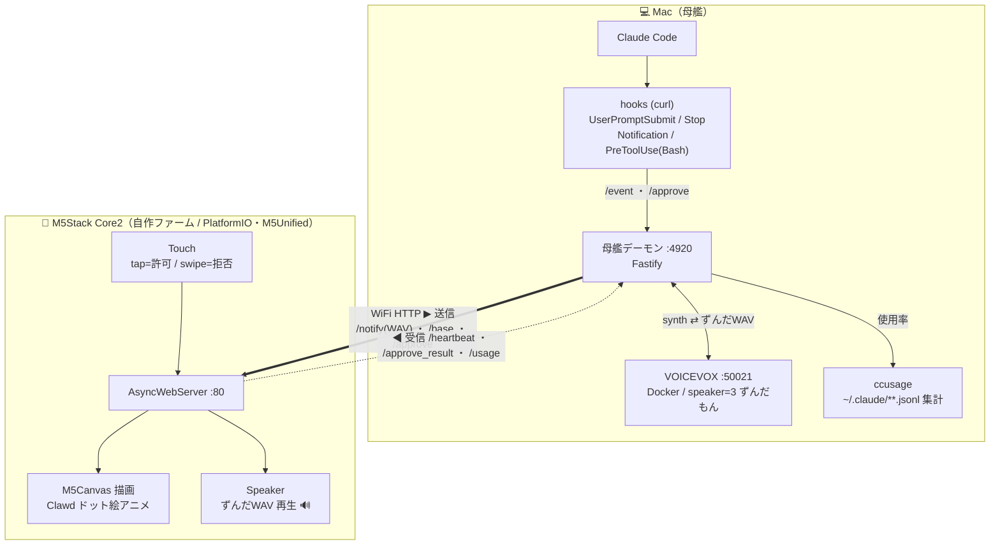
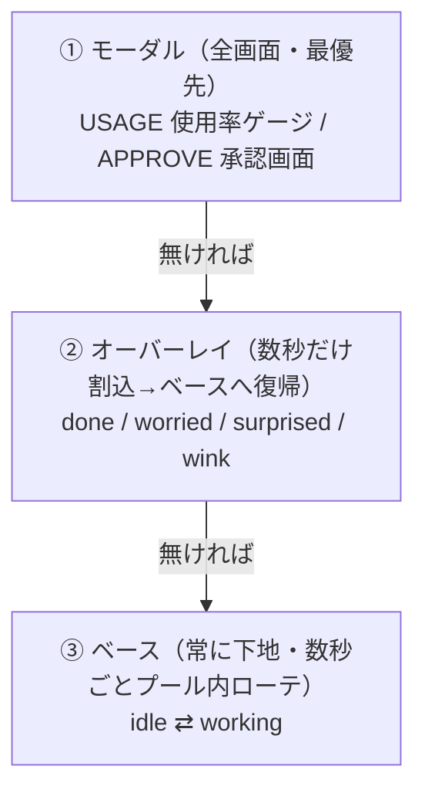
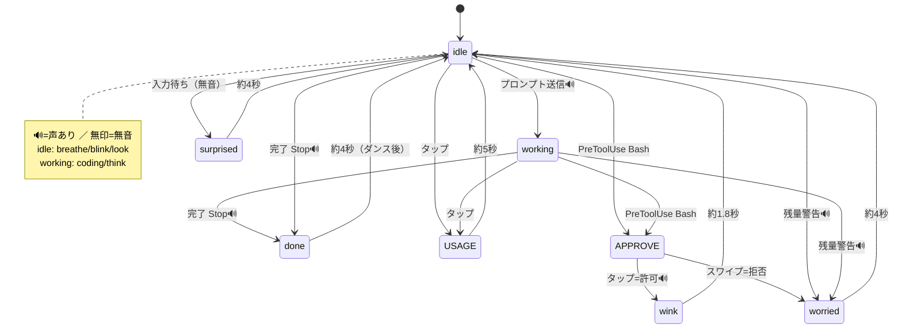
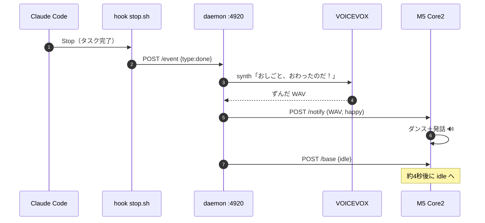
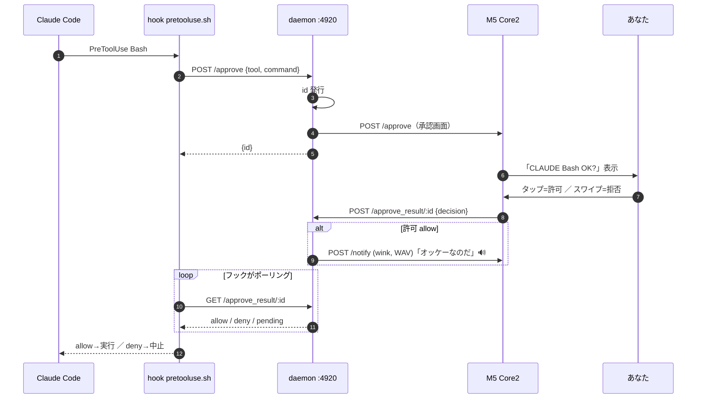
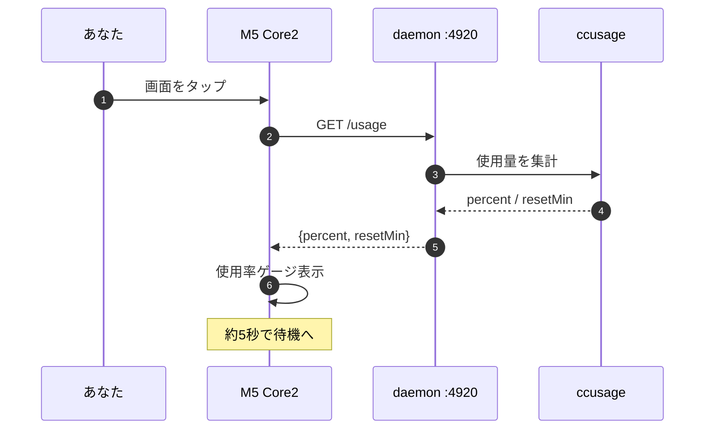
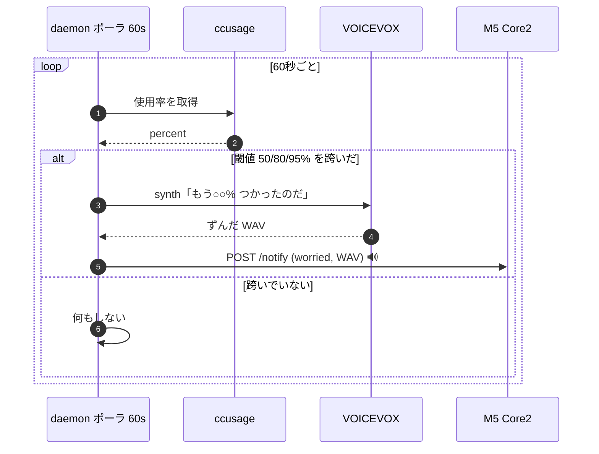

# 設計図 — claudecode_push_display（2026-06-08）

Claude Code の状態を、机上の **M5Stack Core2**（キャラ「Clawd」）が **画面アニメ＋ずんだ声** で知らせるデスクトップ相棒の図面集。
文章仕様は [`2026-06-05-system-design.md`](./2026-06-05-system-design.md) を参照。本書はそれを **図** にしたもの（Mermaid。GitHub / VS Code でそのまま描画）。

---

## 1. システム構成図

母艦（Mac）が頭脳と声、M5 が顔と口・耳。両者は **WiFi HTTP** でつながる。声の合成は Mac 側（VOICEVOX）、再生は常に M5 のスピーカー。

---

## 2. 状態マシン（M5 表示）

### 2.1 3層構造（優先度）

上の層が下を覆う。**モーダル ＞ オーバーレイ ＞ ベース**。

### 2.2 状態遷移

`🔊` = 声あり ／ 無印 = 無音。オーバーレイ（done/worried/surprised/wink）は時間経過で **その時のベース（idle か working）** に戻る（図では idle に集約）。

---

## 3. シーケンス図（主要フロー）

### 3.1 タスク完了通知（主役）

`Stop` フック → daemon が声を合成 → M5 がダンス＋発話 → 待機へ。

### 3.2 タップ承認（PreToolUse Bash）

承認画面を出し、tap=許可 / swipe=拒否。許可時のみ wink＋声。フックは結果をポーリングで取得。

### 3.3 使用率表示（画面タップ）

M5 をタップ → daemon に問い合わせ → ゲージ表示。

### 3.4 残量警告（自動ポーリング）

daemon が 60 秒ごとに使用率を見張り、閾値を跨いだ瞬間だけ警告。

---

## 4. 凡例

| 記号 | 意味 |
|---|---|
| `==>`（実線・太） | Mac → M5 への送信（/notify, /base, /approve） |
| `-.->`（点線） | M5 → Mac への送信（/heartbeat, /approve_result, /usage） |
| `🔊` | 声あり（VOICEVOX ずんだもん。M5 スピーカーで再生） |
| 無印 | 無音（アニメ／画面のみ） |

**音マップ**：喋るのは **working / done / worried / wink** の4つ。**idle / 入力待ち(surprised)** は無音（机上でうるさくない）。
